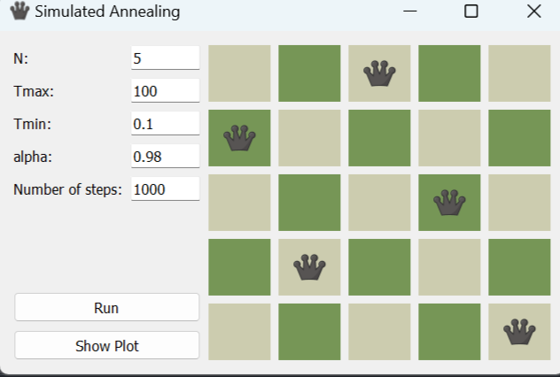
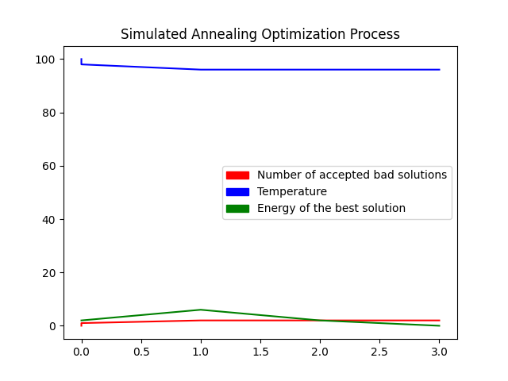
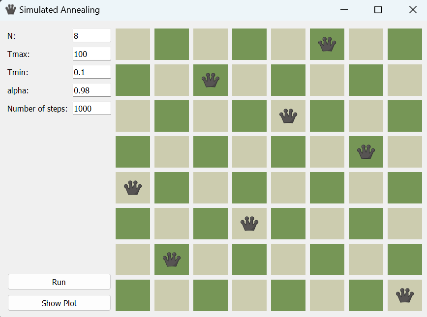
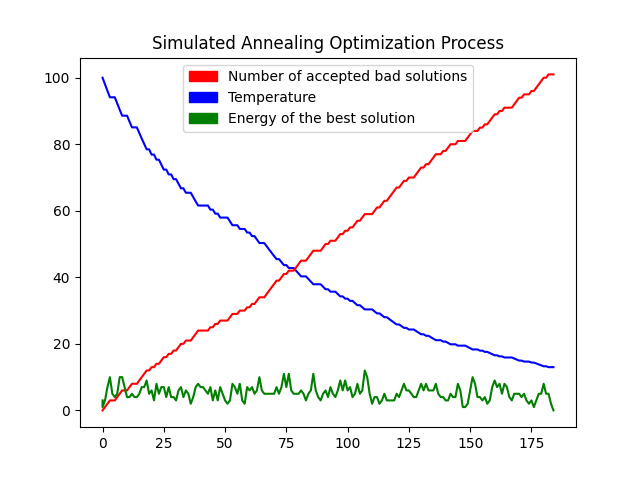
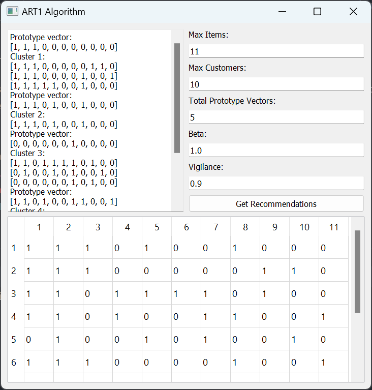
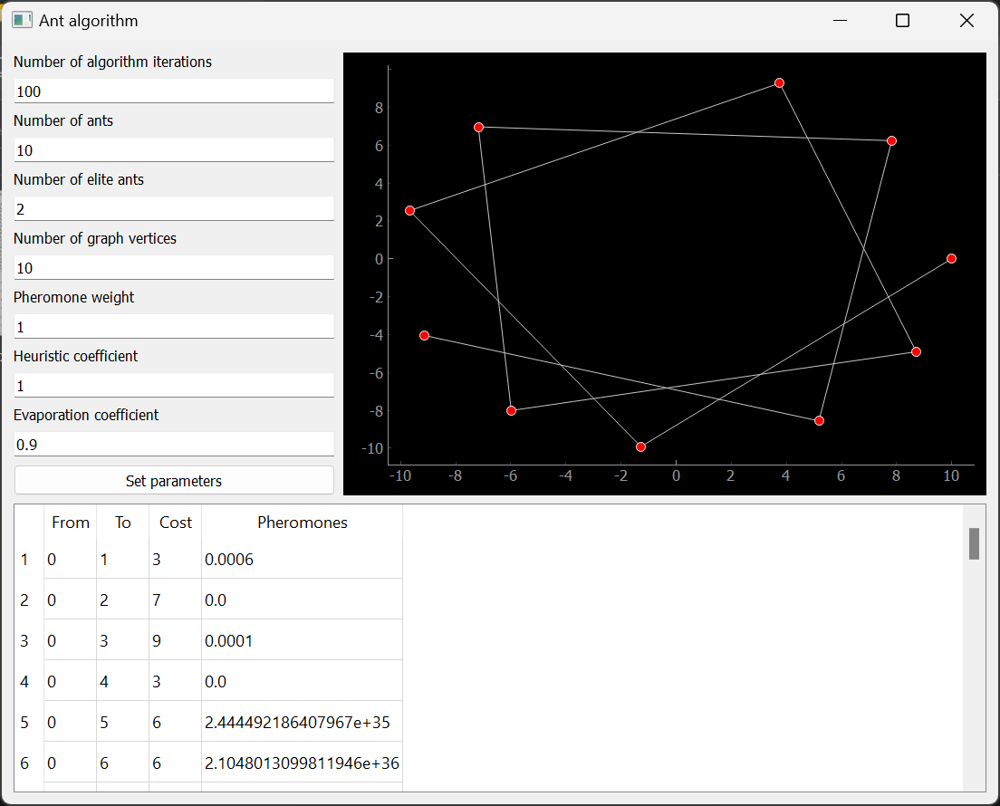
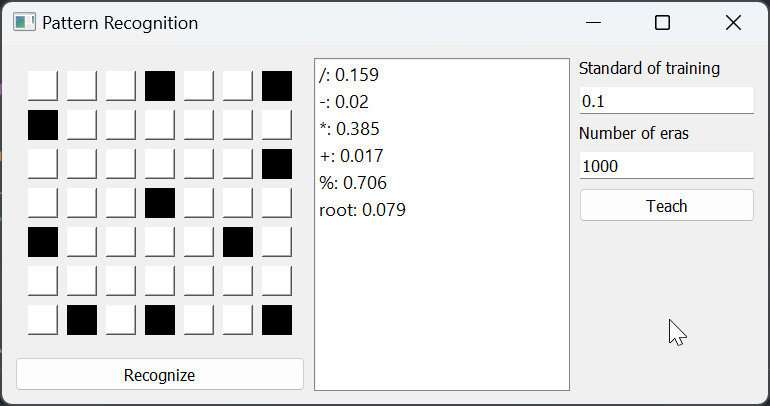
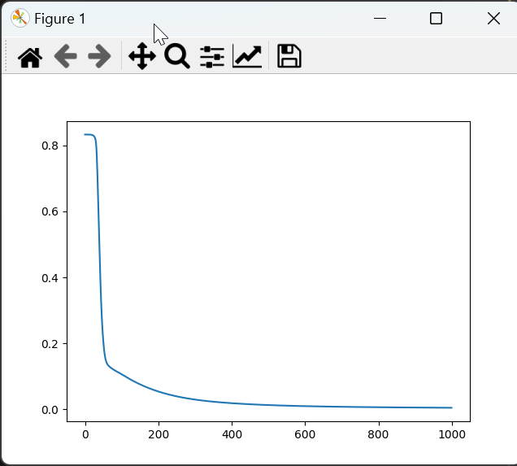

# Artificial Intelligence Basics

This repository contains lab works from the **Artificial Intelligence Basics** course, where various algorithms related to AI were studied and implemented. The labs cover topics such as optimization problems, neural networks, and adaptive resonance theory, providing hands-on experience with these fundamental AI concepts.

---

## Lab Work 1: Simulated Annealing Algorithm
Development and study of the simulated annealing algorithm for solving a numerical optimization problem (N-Queens problem on the same board).

### Results of 5 Queens

### Results of 8 Queens

---

## Lab Work 2: Adaptive Resonance Theory (ART1) Algorithm
Study of the methodology and development technology of the ART1 (Adaptive Resonance Theory) algorithm using a classification problem as an example.

---

## Lab Work 3: Ant Colony Algorithm
Application of the ant colony algorithm to solve the traveling salesman problem.

---

## Lab Work 4: Introduction to Artificial Neural Networks
Development and research of training algorithms for artificial neural networks.

